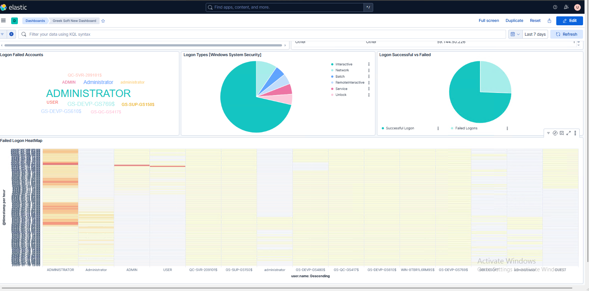
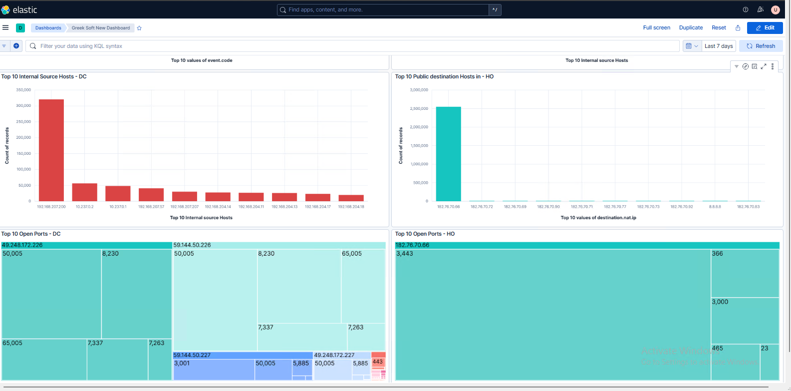
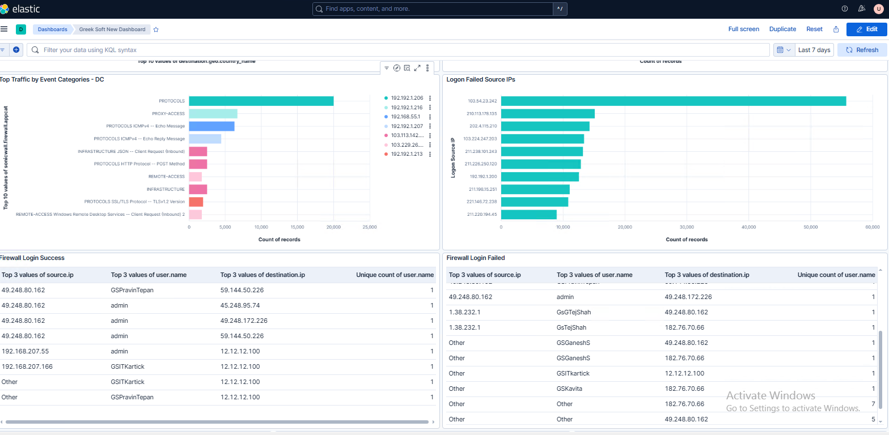
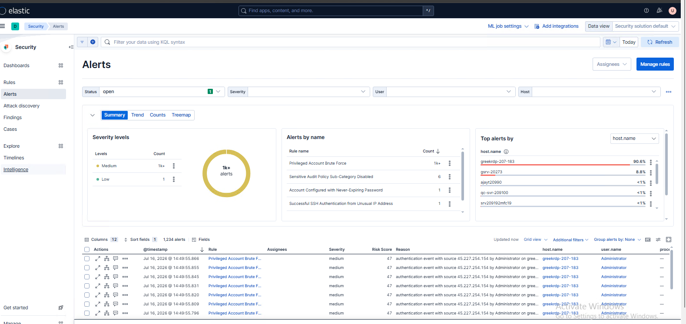
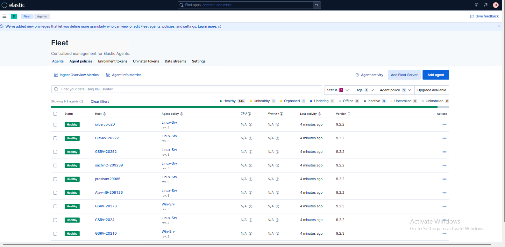
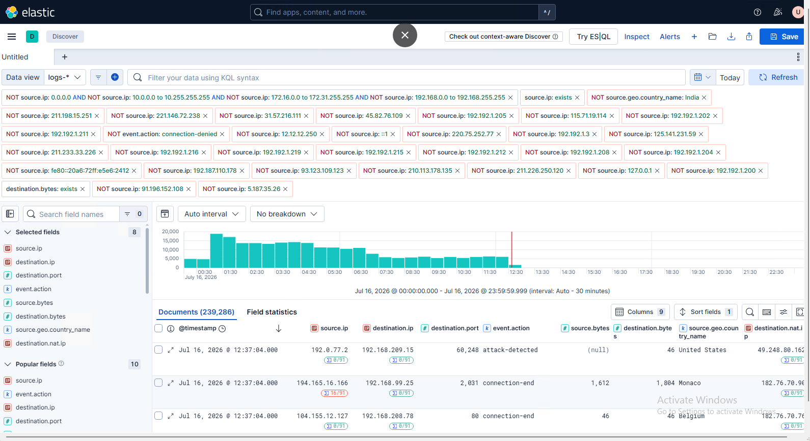

# ELK-Stack-Elasticsearch-Logstash-Kibana-
## 🔐 Authentication Monitoring Dashboard

This dashboard provides real-time visibility into Windows authentication events collected from Elastic Agents. It helps SOC analysts identify suspicious login attempts, monitor authentication trends, and investigate brute-force attacks.

  

### Features

- 👤 Login Failed Accounts
- 🥧 Windows Logon Type Distribution
- 📊 Successful vs Failed Logins
- 🔥 Failed Login Heatmap
- ⏱️ Time-based Authentication Monitoring

### Security Use Cases

- Detect brute-force attacks
- Monitor privileged account activity
- Identify abnormal login behavior
- Investigate authentication failures
- Track login trends over time

### Skills Demonstrated

- Kibana Dashboard
- Windows Event Logs
- Authentication Monitoring
- Threat Hunting
- SOC Investigation

## 🌐 Network Traffic Monitoring Dashboard

This dashboard provides visibility into internal and external network communication to identify suspicious hosts and unusual traffic patterns.

  

### Dashboard Panels

- Top Internal Source Hosts
- Public Destination Hosts
- Top Open Ports
- Network Activity
- Internal Traffic Analysis
- External Connections

### Security Use Cases

- Port Scan Detection
- Network Monitoring
- Lateral Movement Detection
- Data Exfiltration Detection

### Skills Demonstrated

- Network Monitoring
- Firewall Analysis
- Port Analysis
- Traffic Visualization

## 🔥 Firewall Security Dashboard

This dashboard analyzes firewall events to monitor successful and failed login attempts, network access, and protocol usage.

  

### Dashboard Features

- Firewall Login Success
- Firewall Login Failed
- Top Event Categories
- Source IP Analysis
- Destination IP Analysis
- User Activity

### Security Monitoring

- Unauthorized Access
- Firewall Authentication
- Remote Access Monitoring
- Protocol Analysis
- User Activity Tracking

### Skills Demonstrated

- Firewall Monitoring
- Authentication Analysis
- Threat Detection
- Security Visualization

## 🚨 Elastic Security Alerts

The Alerts dashboard displays security detections generated by Elastic Security rules. It helps analysts prioritize and investigate high-risk activities across monitored endpoints.

  

### Detection Rules

- 🚨 Privileged Account Brute Force
- 🔐 Unusual SSH Authentication
- ⚠️ Audit Policy Changes
- 👤 Password Configuration Changes
- 🔥 Failed Login Detection

### Dashboard Features

- Alert Severity Levels
- Alert Summary
- Risk Score
- Rule Name
- Host Details
- User Information
- Alert Timeline

### Security Benefits

- Faster Incident Response
- Centralized Alert Management
- Threat Prioritization
- Security Event Correlation

### Skills Demonstrated

- Elastic Security
- Detection Engineering
- Alert Investigation
- Incident Response

## 🚀 Elastic Fleet Management

Fleet provides centralized management of Elastic Agents deployed across Windows and Linux systems.

  

### Features

- Agent Enrollment
- Agent Health Monitoring
- Policy Management
- Version Tracking
- Data Stream Monitoring
- Integration Management

### Agent Information

- Hostname
- Operating System
- Agent Version
- Last Activity
- Policy Assignment
- Agent Status

### Security Benefits

- Centralized Endpoint Management
- Real-time Agent Monitoring
- Easy Deployment
- Simplified Configuration

### Skills Demonstrated

- Elastic Fleet
- Elastic Agent
- Endpoint Management
- SIEM Administration

## 🔍 Discover - Threat Hunting

The Discover page enables analysts to perform advanced log searches using Kibana Query Language (KQL) for rapid investigation and threat hunting.

  

### Investigations

- Source IP Analysis
- Destination IP Analysis
- Country-based Traffic
- Network Connections
- Firewall Events
- Authentication Events

### Filters Used

- Source IP
- Destination IP
- Event Action
- Geo Location
- Bytes Transferred
- Timestamp

### Security Use Cases

- IOC Hunting
- Malware Investigation
- Suspicious Traffic Analysis
- Network Investigation
- Event Correlation

### Skills Demonstrated

- KQL
- Threat Hunting
- Log Analysis
- Security Investigation

# 👨‍💻 Author

**Umang Patel**

🎯 SOC Analyst | Cyber Security Enthusiast | SIEM | ELK Stack | Threat Hunting | Log Analysis
